# TRACE32 RISC-V 用户使用指南

## 1. 概述

TRACE32 调试器全面支持 RISC-V 架构，基于 RISC-V Debug Specification 提供完整的调试与跟踪解决方案。核心功能包括：

- **JTAG 调试**：通过 JTAG-DTM 访问 Debug Module，支持单核、多核 SMP/AMP 调试。

- **OS 相关调试**：原生支持裸机、FreeRTOS（单核/多核）及 Linux 内核调试。

- **E-Trace 数据跟踪**：支持数据读写跟踪、地址/值匹配及跳转优化，适用于性能分析。

详细参考：TRACE32 手册 → *RISC-V Introduction*

---

## 2. 基本调试使用

### 2.1 Trace32 基本设置

- **Add Configuration**

打开trace32 软件，右键点击Configuration Tree, 依次选择 Add->Configuration

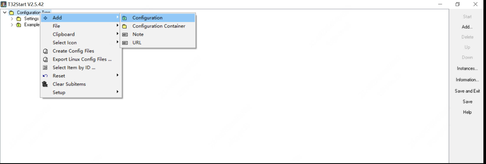

F2 修改Configure名字，比如nuclei_config

- **Add Podbus Device Chain**

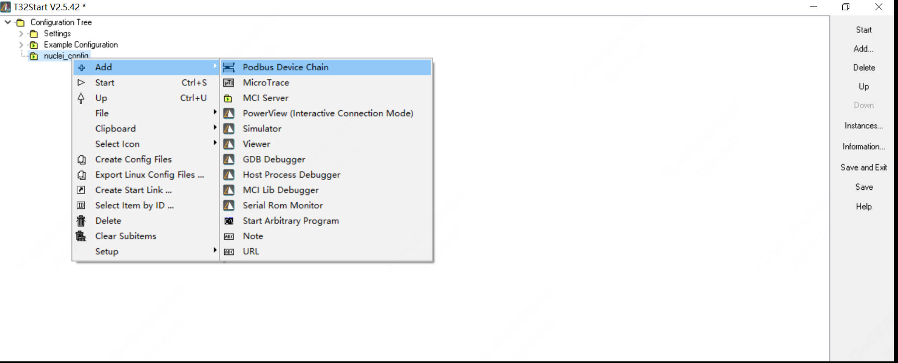

- **Add Power Device**

根据当前使用的Trace32硬件设备类型选择

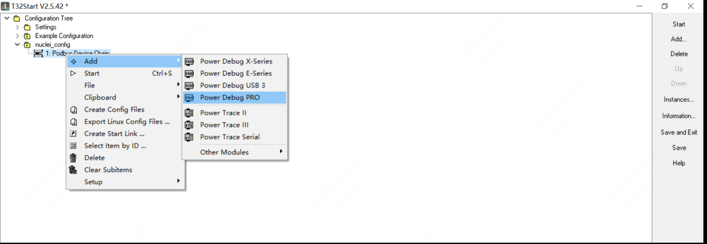

- **Choose Connection Type**

根据Trace32和电脑的连接方式选择，当前使用的是USB线连接电脑，Connection Type选择USB

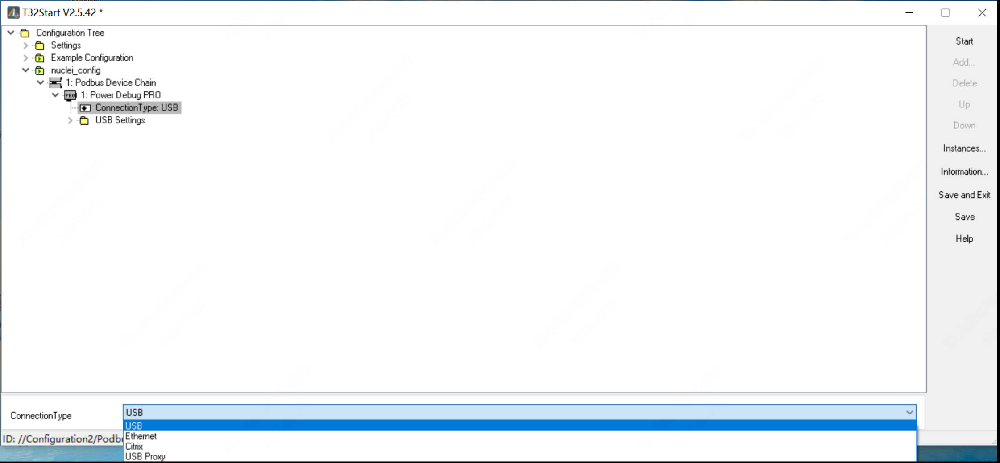

- **Add PowerView Instance**

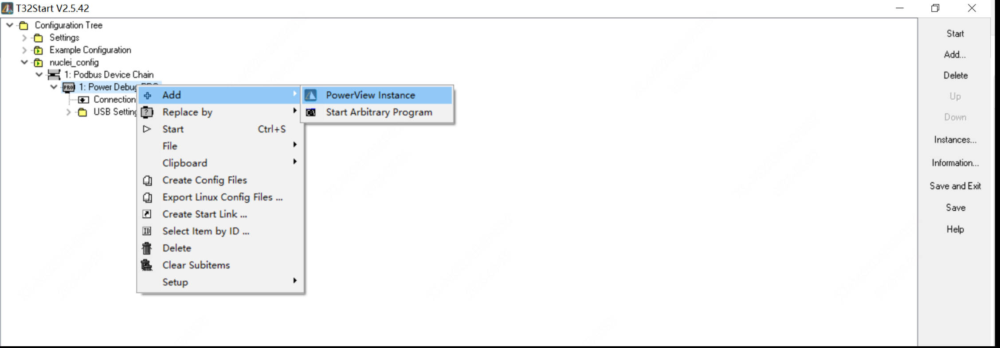

右键选择Target 为RISC-V
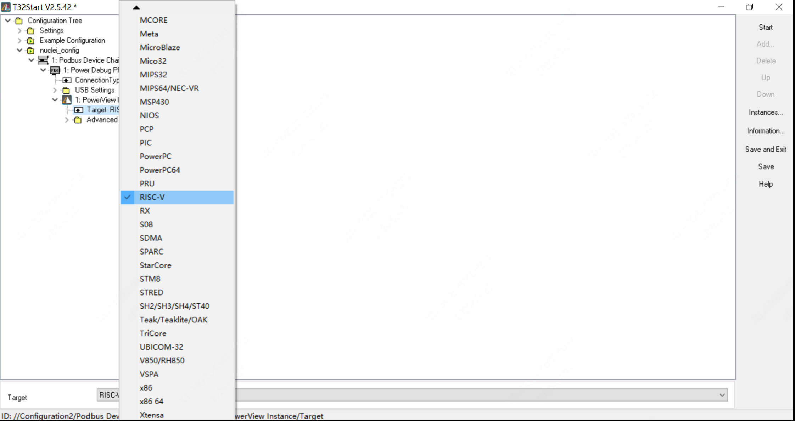

- **Start**

点击右边`Save` 先保存配置，点击右边`Start` 按钮就可以进入Trace32 主界面, 因为Trace32 还没有通过JTAG连接待调试的开发板，所以图中右下角是PowerDown状态

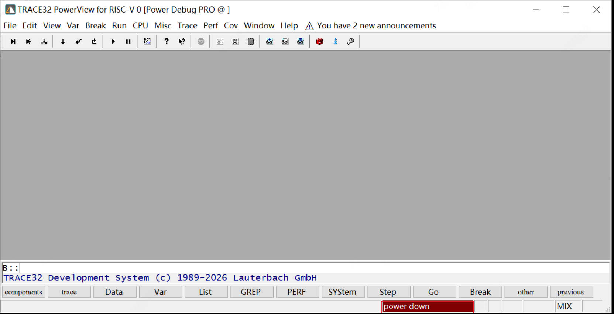

- **Run Script**

选择要执行的cmm脚本
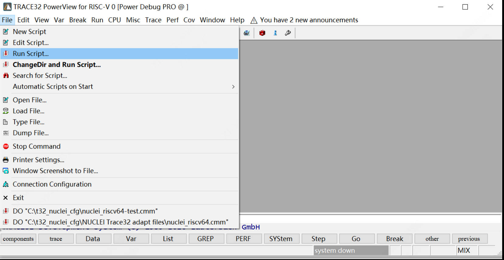


详细的用法可以参考trace32 help或者trace32 安装目录下`pdf/app_t32start.pdf`

### 2.2 Trace32 DM 配置

调试器需要知道怎样访问DM模块的寄存器，所以需要配置DM。通过外部 JTAG 接口访问 RISC-V 调试模块（DM）简图：
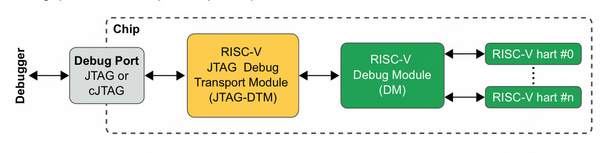

#### 2.2.1 隐式配置JTAG-DTM

如果系统中只有一个JTAG-DTM和一个DM，调试器会自动识别JTAG链参数，不用额外配置。但如果是cJTAG连接需要增加下面的配置：

```
SYStem.CONFIG.DebugPortType CJTAG
SYStem.CONFIG.CJTAGFLAGS NOTCA NOKEEPER NOHARDESC CMDRTI SKIPDUMMYSP SKIPMASK 0xF CPKTSEL 1
```

典型的rv64 cmm脚本如下。如果是cjtag连接，把`;`注释去掉，开启cjtag连接方式。
   ```shell
    RESet                           ;Reset debugger configuration

    ;SYStem.CONFIG.DebugPortType CJTAG
    ;SYStem.CONFIG.CJTAGFLAGS NOTCA NOKEEPER NOHARDESC CMDRTI SKIPDUMMYSP SKIPMASK 0xF CPKTSEL 1

    system.jtagclock 10MHz          ; Set JTAG clock frequency
    SYStem.Option.RESetmode NDMRST  ; Select the reset method
    SYStem.cpu RV64                 ;Select the SoC/CPU/core
    ; 直接连接，TRACE32 会自动通过 JTAG-DTM 去探测 DM
    SYStem.up                       ;resets soc and enters debug mode

    list
   ```

#### 2.2.2 显式配置JTAG-DTM

如果复杂JTAG链，需要手动指定JTAG链参数，需要用RVDMIAP和COREDEBUG。典型的rv64 cmm脚本如下：

   ```shell
    RESet

    system.jtagclock 10MHz
    SYStem.Option.RESetmode NDMRST
    SYStem.cpu RV64

    SYStem.CONFIG RVDMIAP1.DebugSource DebugPort    ;External debug port
    SYStem.CONFIG RVDMIAP1.IRLENGTH 5.              ;Configure JTAG daisy chain
    SYStem.CONFIG RVDMIAP1.IRPRE 0.
    SYStem.CONFIG RVDMIAP1.IRPOST 0.
    SYStem.CONFIG RVDMIAP1.DRPRE 0.
    SYStem.CONFIG RVDMIAP1.DRPOST 0.
    SYStem.CONFIG COREDEBUG.Base DMI:0x0            ;RISC-V DM

    SYStem.Up                                       ;resets soc and enters debug mode
   ```

`SYStem.DETECT.DaisyChain` 命令可以探测出JTAG情况，下面图是N300 AMP两个core，一个JTAG Port，两个TAP用jtag-chain连接的情况：
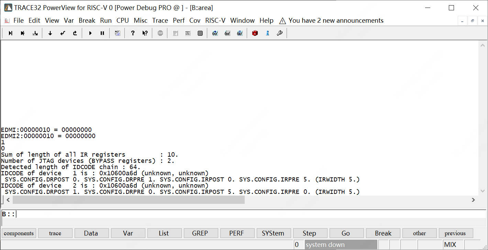

其cmm 脚本可参考`https://github.com/Nuclei-Software/lauterbach-startup` 中nuclei_riscv32_jtagchain_dmi.cmm

详细参考：TRACE32 debugger_riscv.pdf → *Quick Start for Debug Module Configuration*


### 2.3 单核调试

可从https://github.com/Nuclei-Software/lauterbach-startup 下载对应ARCH的cmm脚本连接CPU核，
比如用nuclei_riscv64.cmm，连接rv64 单核SOC。
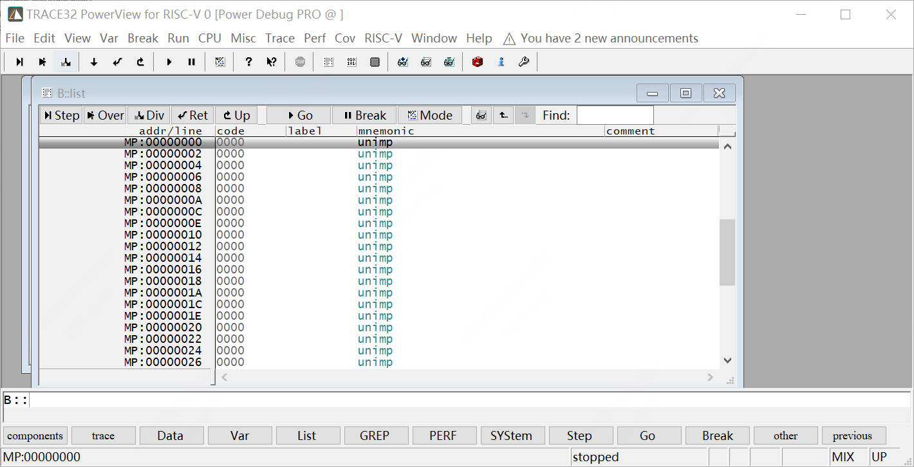

### 2.4 多核 SMP 调试

可从https://github.com/Nuclei-Software/lauterbach-startup 下载对应ARCH的cmm脚本连接CPU核，
比如用nuclei_riscv64_smp2.cmm，连接rv64 SMP2的SOC，多核的可以看到界面下底部有数据0，表示逻辑core0，可以右键点击切换核心，单核是没有的。
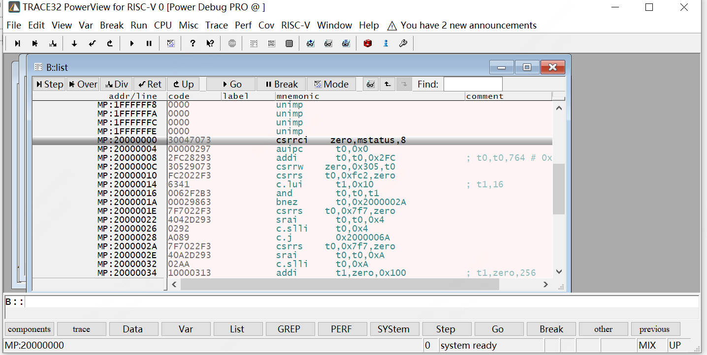

### 2.5 多核 AMP 调试

可从https://github.com/Nuclei-Software/lauterbach-startup 下载对应ARCH的cmm脚本连接CPU核，
比如用nuclei_riscv32_jtagchain_dmi.cmm，连接rv32 AMP的SOC。
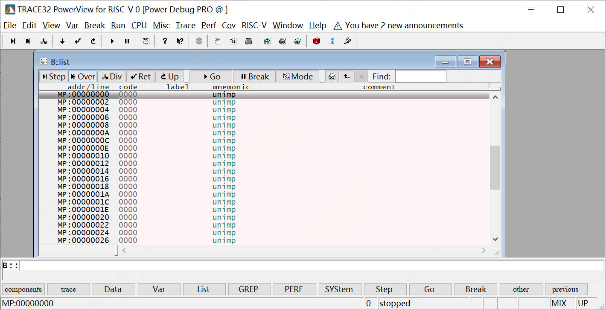

### 2.6 自定义指令与CSR解析

如果程序中有用到NUCLEI 自定义的指令或者自定义CSR，需要加载解析文件Trace32才能解析成对应的指令或者CSR，否则界面显示是数字，不是对应名字的指令或CSR。

从https://github.com/Nuclei-Software/lauterbach-startup 下载解析NUCLEI自定义指令的解析文件`nuclei_custom_inst_parser.dll` , 用`apu.load` 命令加载
`apu.load nuclei_custom_inst_parser.dll`

从https://github.com/Nuclei-Software/lauterbach-startup 下载解析NUCLEI自定义CSR的解析文件`nuclei_custom_csr_parser.per` , 用`per` 命令加载
`per nuclei_custom_csr_parser.per`

---

## 3. 基本调试命令

可以使用Trace32主界面上的按钮来调试，包括step, step.over, go, break, memory, register, watch, break, stack 等。
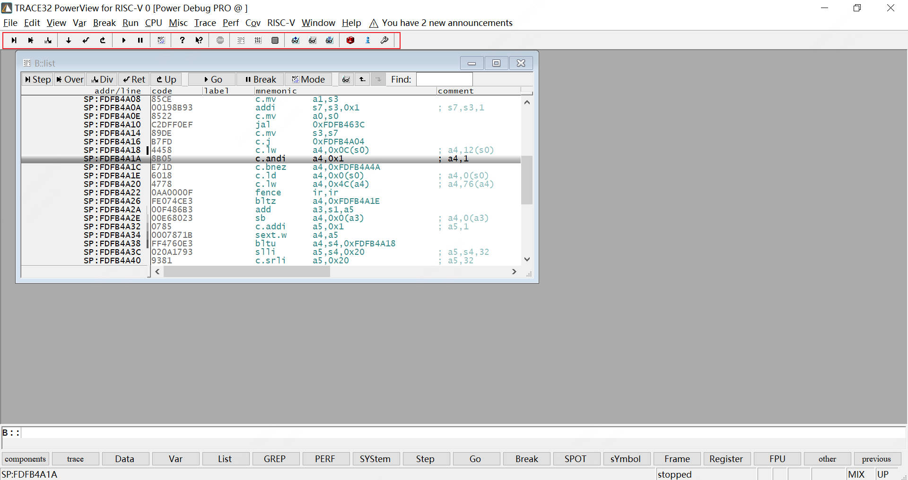

除了界面上按钮直接调试外，可以在主界面的底部输入框中输入命令，比如常见的break命令，就是停止cpu执行，下面列举了一些命令，命令字符串不区分大小写，更多详情请参考TRACE32 手册。

### 3.1 寄存器读写

- 显示全部通用寄存器：`Register`
- 读单个寄存器：`print r(reg)`, 比如显示pc值：print r(pc)
- 写单个寄存器：`r.set reg addr`, 比如修改pc值为0xfdfc9000：`r.set PC 0xfdfc9000`

*注：没有`r.get` 命令*

### 3.2 Memory 读写

- 读写内存：`Data.Dump`、`Data.Set`
  `data.dump addr`: 访问addr地址内容
  `data.dump A:phy_addr`: 直接访问物理地址内容
  `data.dump E:addr`: cpu不停下来，访问地址内容

`A`, `E` 是不同access class，更多详情参考Trace32文档。

### 3.3 CSR 读写

rv64读取单个csr:(mstatus csr 地址是0x300)
PRINT Data.Quad(CSR:0x300)

rv32读取单个csr:
PRINT Data.Long(CSR:0x300)

rv64 写val值到csr 0x300(mstatus)
Data.Set CSR:0x300 %LE %Quad val

读一片csr:
Data.dump CSR:0x300

*注：Trace32 当前通过命令访问RISC-V CSR不能用名称，需要用地址*

### 3.4 单步执行

- 单步：`Step`
  若当前是汇编模式，则执行一条指令；若在HLL（高级语言）源码模式，则执行一行C代码，类似gdb中s命令或者si命令
- 汇编单步：`Step.asm`
  无论当前显示模式如何，都只执行一条汇编指令，类似gdb中si命令
- 单步跳过：`Step.Over`
  执行当前函数调用，但不会进入其内部，而是停在该函数返回后的下一条语句，类似gdb中next命令

### 3.5 断点

- 软件断点：`Break.Set`
  在某个地址设置程序断点，比如：`Break.Set 0x0C008000`
- 硬件断点：`Break.Set /onchip`
  在某个地址设置程序断点，比如：`Break.Set 0x0C008000 /Onchip`
- 删除断点： `break.delete`
  删除某断点，比如：`Break.delete 0x0C008000`
- 关闭断点： `break.disable`

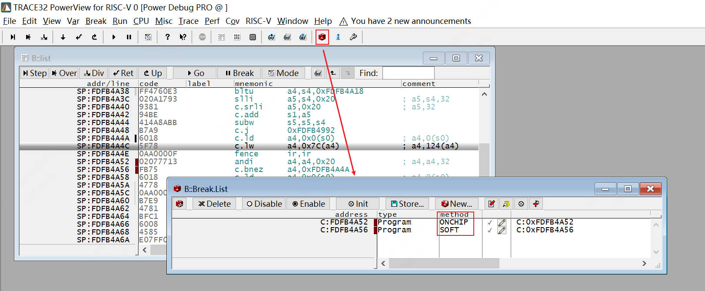

### 3.6 Watchpoint

还是基于break.set 命令，只是增加了访问类型
```
; Stop the program execution at a write access to 0xfd76b9e8
break.set 0xfd76b9e8 /write /onchip

; Stop the program execution at the instruction address 0x2228 only if 
; the contents of Register R7 is greater 5.
Break.Set 0x2228 /Program /CONDition Register(R7)>5

; Stop the program execution at the instruction address 0x2228 only if
; the contents of address 0x1234 has value of 0x55.
`Break.Set 0x2228 /Program /CONDition Data.Word(D:0x1234)==0x55
```
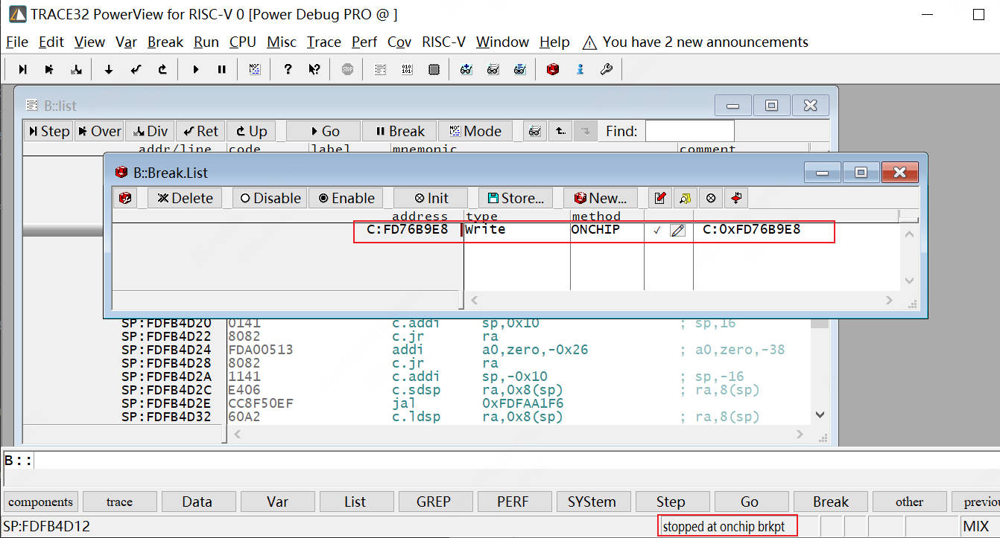

```
; Stop the program execution when write global_counter var，need load symbol file
Break.Set global_counter /Write
```

详细参考：TRACE32 手册 → *pdf/general_ref_b.pdf*

### 3.7 MMU页表查询

如果系统开启了MMU，可查询页表映射情况：

`mmu.list.pagetable`: 显示系统全部页表映射

### 3.8 下载程序到内存

- 加载bin到指定地址：`data.load.binary your_bin_file address`
- 加载elf 文件：`data.load.elf your_elf_file`
- 仅加载elf 符号表：`data.load.elf your_elf_file /nocode`

---

## 4. 操作系统调试

以Linux kernel为例说明：

连接cpu的cmm脚本中需要下面的配置
```
TRANSlation.CONFIG.MMUSPACES ON
TRANSlation.TableWalk ON
TRANSlation.ON
```

调试Linux注意一下几点：
1. 编译的Linux kernel 需要配置：`CONFIG_DEBUG_INFO=y` , 如需更多符号表：`CONFIG_KALLSYMS=y`
2. 加载vmlinux 符号表：`data.load.elf your_vmlinux_file /nocode`
3. 如要查看task： `TASK.CONFIG C:\T32\demo\riscv\kernel\linux\awareness\linux.t32`
4. 通过Linux标签查看相关内容：
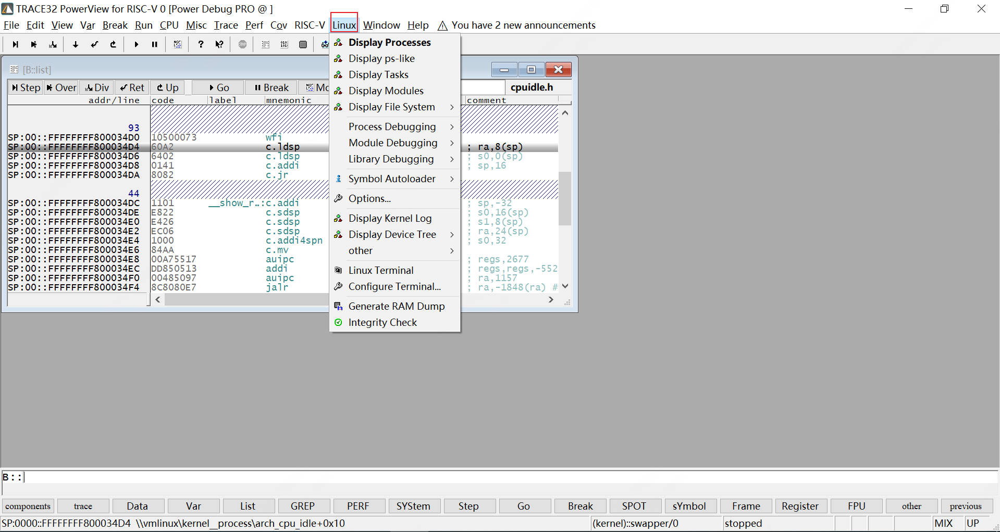

操作系统相关的调试可以参考Trace32 安装目录下的`pdf/rtos_<os>.pdf` 对应的文档。

---

## 5. Flash 烧录

可从https://github.com/Nuclei-Software/lauterbach-startup 下载对应ARCH的cmm脚本（nuclei_riscv64_flash.cmm用于rv64，nuclei_riscv32_flash.cmm用于rv32）和flash目录，cmm脚本连接CPU核进行flash烧录，burn_test.bin是待烧录的文件，flash目录中是烧录工具。

下面是把burn_test.bin 名字改为freeloader.bin的烧录图。

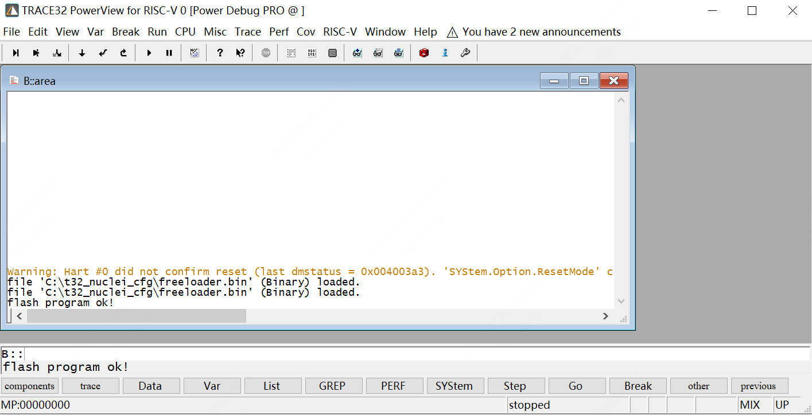

---

## 6. Cross Trigger 调试功能

Cross Trigger 是将一个核心或硬件线程的调试事件（如遇到断点、进入调试模式）同步地传递给其他核心，使它们能够协同地暂停或恢复运行。

Trace32 调试器已支持，只需要把JTAG-DTM配置在cmm脚本中描述清楚就行。

下面是我们在内部n300 bit上测试的情况：

1. 用https://github.com/Nuclei-Software/lauterbach-startup 中nuclei_riscv32_jtagchain_dmi.cmm 连接cpu

2. 切换不同核心，加载不同elf

  - 逻辑core0 在ILM上跑helloworld
    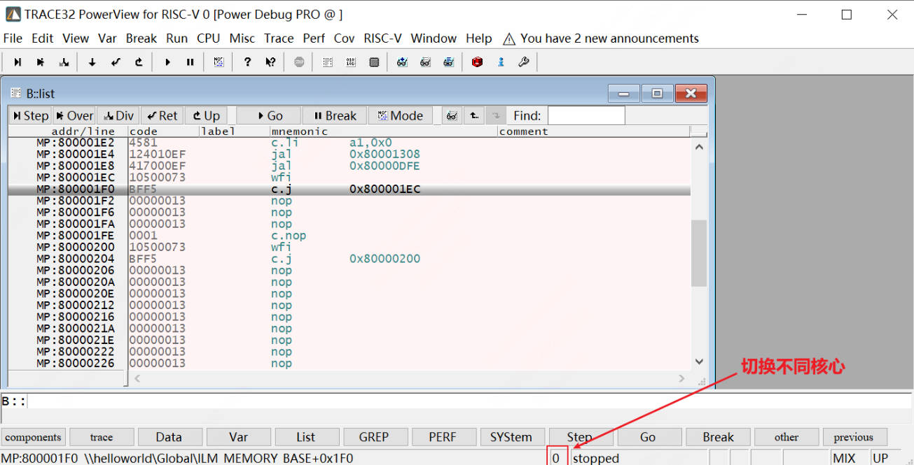

  - 逻辑core1 在SRAM上跑helloworld
    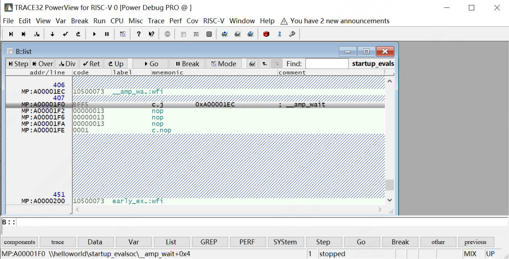

点击运行或者暂停，两者都可以同步运行或暂停，实现了联动。

---

## 7. Authentic 功能

通过DM auth data寄存器来设置调试密码，实现安全调试功能。以下是Authentic Module与NUCLEI CPU的连接图。

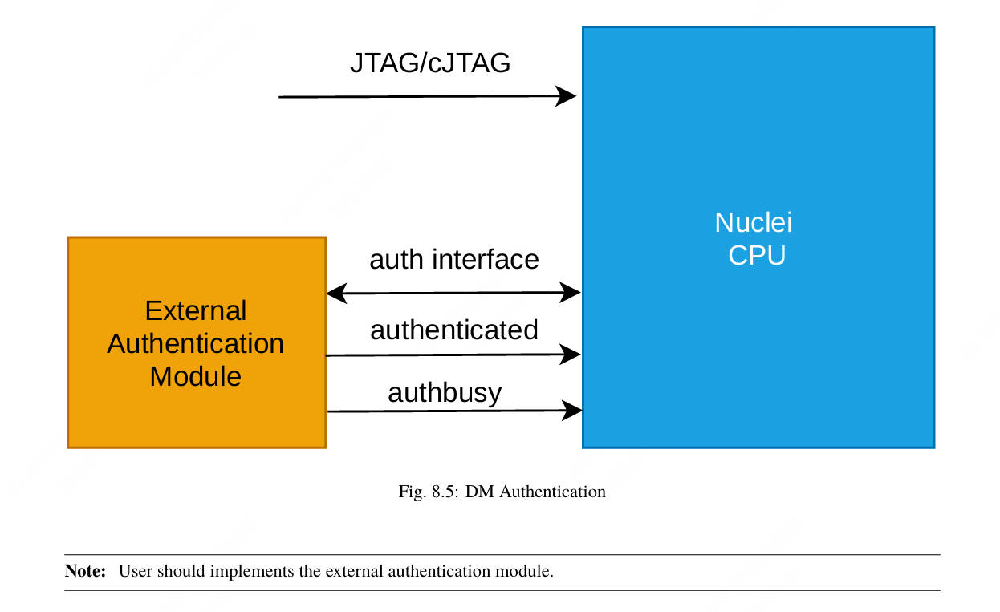

例如在cmm脚本中配置调试密码：authdata 寄存器地址0xC0，用第0个逻辑核心把密码`0x3c3c3c3c`写到authdata 寄存器

```
core.select 0.
Data.Set EDMI:0xC0 %LE %Long 0x3c3c3c3c
```

当鉴权不成功时候，调试将无法进行。

由于鉴权模块需要用户自己实现，我们在内部n300 bit上模拟测试authentic，bit已预设了密码，所以连接cpu时候不会报错，但这不是真实情况，我们只做模拟测试。

1. 用`https://github.com/Nuclei-Software/lauterbach-startup` 中nuclei_riscv32_jtagchain_dmi.cmm 连接cpu

2. 读取DM的dmstatus 寄存器

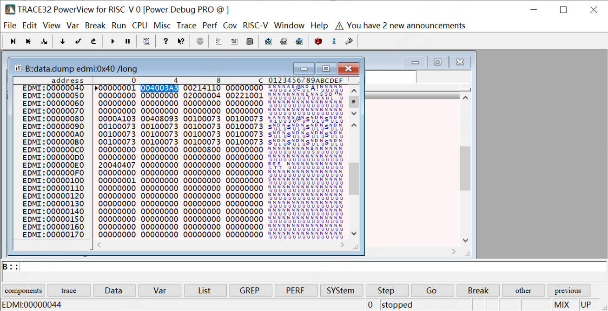

dmstatus：0x4003A3，authenticated（bit7）已验证通过, 这是bitfile预先配置好的。

3. 写authdata 寄存器

下面写正确密码到auth data 都不会导致调试器报错，正确密码：0x3c3c3c3c。

```
core.select 0.
Data.Set EDMI:0xC0 %LE %Long 0x3c3c3c3c
core.select 1.
Data.Set EDMI2:0xC0 %LE %Long 0x3c3c3c3c
```

写错误密码后，调试器报错异常：
`Data.Set EDMI2:0xC0 %LE %Long 0x3c3c3c3d`

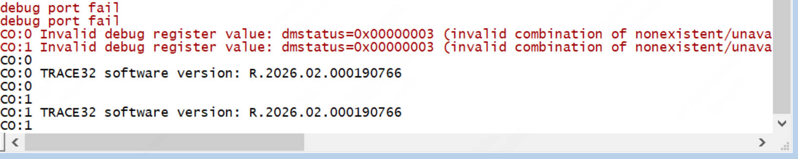

---

## 8. Trace 功能

TBD

---
